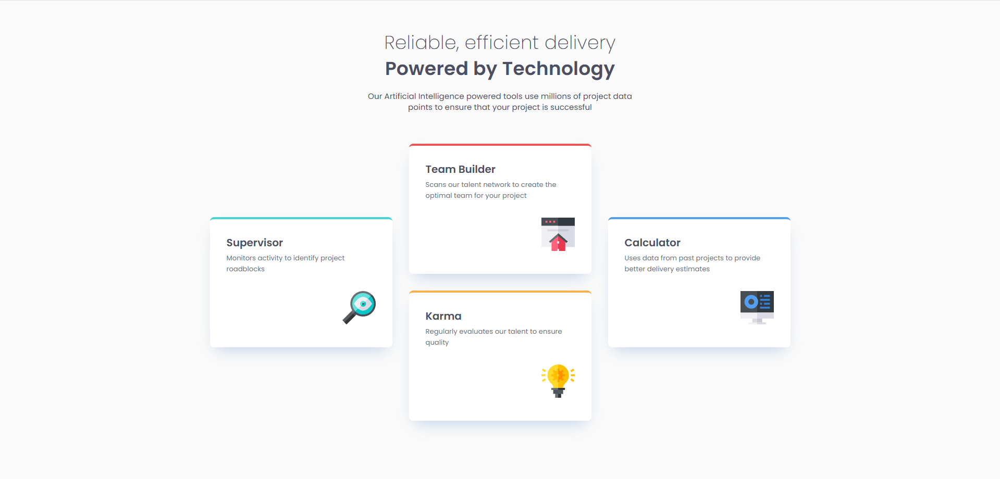
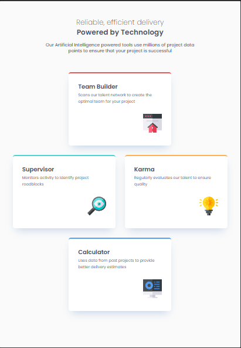
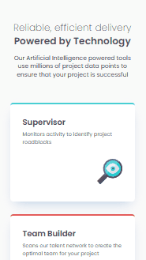

# Frontend Mentor - Four card feature section solution

This is a solution to the [Four card feature section challenge on Frontend Mentor](https://www.frontendmentor.io/challenges/four-card-feature-section-weK1eFYK). Frontend Mentor challenges help you improve your coding skills by building realistic projects. 

## Table of contents

- [Overview](#overview)
  - [The challenge](#the-challenge)
  - [Screenshot](#screenshot)
  - [Links](#links)
- [My process](#my-process)
  - [Built with](#built-with)
  - [What I learned](#what-i-learned)
  - [Continued development](#continued-development)
  - [Useful resources](#useful-resources)
  - [AI Collaboration](#ai-collaboration)
- [Author](#author)
- [Acknowledgments](#acknowledgments)

## 📌 Overview
This project is a solution to the **Four Card Feature Section** challenge from Frontend Mentor, aimed at improving layout structuring and responsiveness skills.

### 🎯 The challenge

Users should be able to:

- View the optimal layout for the site depending on their device's screen size

## 🖼️ Preview
### 🖥️ Desktop

### 📱 Tablet

### 📱 Mobile

### Links
- 💻 [Repository](https://github.com/israel-monteiro/fm-four-card-feature-section.git)
- 🌐 [Live Site](https://israel-monteiro.github.io/fm-four-card-feature-section/)
- 📌 [Challenge](https://www.frontendmentor.io/challenges/four-card-feature-section-weK1eFYK) 

## My process

### ⚙️ Built with

- Semantic HTML5
- CSS
- Flexbox
- CSS Grid
- Mobile-first workflow

### 📚 What I learned

During the development of this project, I put into practice:

- The use of **CSS Grid** to create more flexible and well-structured layouts  
- The **Mobile First** approach, ensuring a solid foundation for responsiveness  
- Building adaptable layouts using media queries  
- Best practices for organizing CSS files  

### 🚧 Continued development

I plan to improve my proficiency in **CSS Grid**, focusing on building more efficient, well-structured, and cleaner layouts, while using it strategically alongside **Flexbox**.

Additionally, I aim to further develop my use of the **Mobile First** approach, prioritizing mobile development and ensuring smooth adaptation across different screen sizes.

### Useful resources

### 🧠 AI Collaboration

During the development of this project, I used Artificial Intelligence tools, such as ChatGPT, to assist in different stages of the process.

- **Code refactoring**: I used AI to review and improve code structure, making it cleaner and more efficient  
- **Error detection**: support in identifying and fixing potential issues in the code  
- **Initial GitHub support**: I used AI as guidance at the beginning of the project, especially to set up the repository and make the first commits  

Overall, AI was helpful in speeding up development, clarifying doubts, and suggesting best practices. However, it was important to review the suggestions to ensure they were appropriate for the project's context.

## Author

- Frontend Mentor - [@israel-monteiro](https://www.frontendmentor.io/profile/israel-monteiro)
- GitHub - [@israel-monteiro](https://github.com/israel-monteiro)

